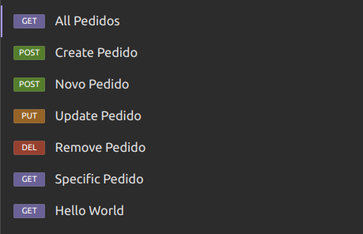
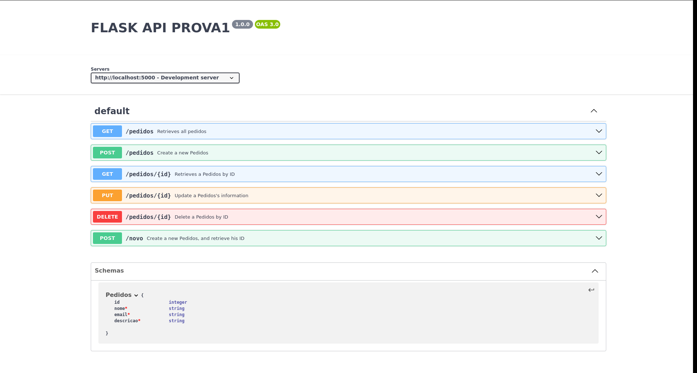

# API nível de maturidade 2 - Pablo Ruan Lana Viana

## Descrição

API RESTful que implementa o nível de maturidade 2 do Richardson Maturity Model. A API é um CRUD de pedidos de usuários, que armazena o nome, e-mail e a descrição do pedido, em um banco de dados PostgreSQL.

Para a implementação da API, foi utilizado o framework Flask, e para a documentação da API, foi utilizado o Swagger. Para a realização dos testes, foi utilizado o Insomnia, cuja coleção de requisições está disponível no arquivo `insomnia.json`. Por fim, toda a aplicação foi containerizada com Docker, para facilitar a sua execução.

## Estrutura de pastas

O projeto está estruturado da seguinte forma:

```
.
├── api
│   ├── Dockerfile
│   ├── requirements.txt
│   ├── src
│   │   ├── main.py
│   │   ├── common
│   │   │   ├── create.py
│   │   │   ├── delete.py
│   │   │   ├── read.py
│   │   │   ├── update.py
│   │   ├── configuration
│   │   │   ├── config.py
│   │   ├── database
│   │   │   ├── database.py
│   │   │   ├── models.py
│   │   ├── routes
│   │   │   ├── pedidos.py
├── build
│   ├── docker-compose.yaml
├── static
│   ├── insomnia.png
│   ├── swagger.png
├── insomnia.json
├── swagger.yaml
├── README.md
```

## Execução

Para executar a aplicação, é necessário ter o Docker e o Docker Compose instalados. Com essas dependências instaladas, basta executar o seguinte comando:

```bash
docker-compose up
```

Após a execução do comando, a aplicação estará disponível em `http://localhost:5000`.

## Insomnia

A imagem abaixo mostra a coleção de requisições no Insomnia



## Swagger

A imagem abaixo mostra a documentação da API no Swagger

